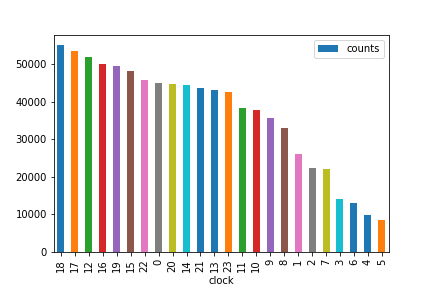
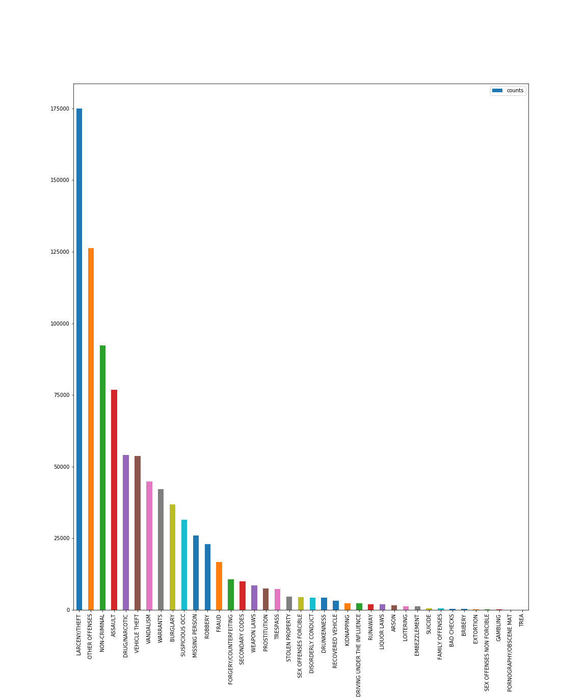
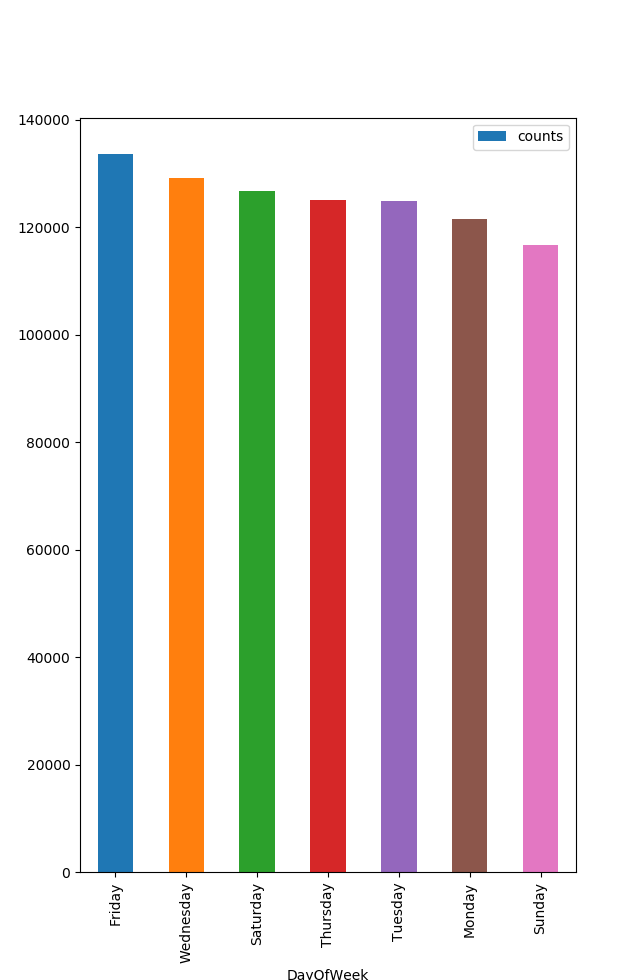
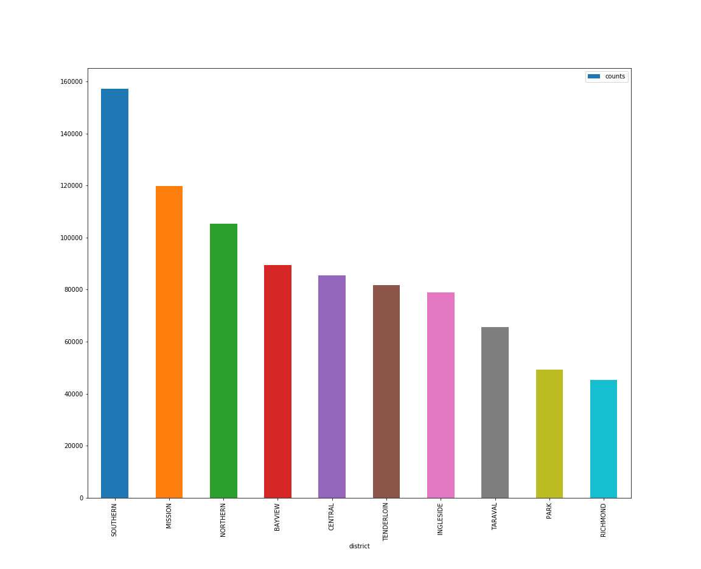
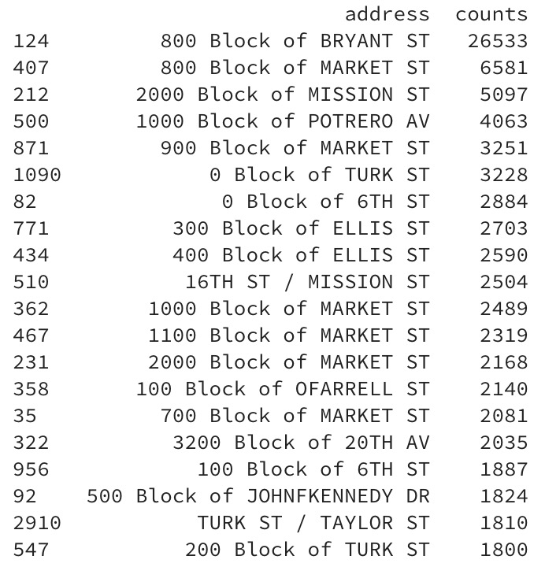

## 旧金山罪案类型预测

### 项目背景 
项目是Kaggle上的一个竞赛，该竞赛的目的是利用机器学习方法预测旧金山可能发生的犯罪类型。

1849年，随着加州淘金热的浪潮，旧金山经历了第一次繁荣，在随后的的几十年经历了城市面积激增和人口爆炸。人口的爆炸不可避免的带来了社会问题和高犯罪率，当然红灯区的存在也是一个很重要的原因[^1]。1934至1963年，旧金山因将一些罪行严重的罪犯关在恶魔岛而声名狼藉。而今因为很多高科技公司的存在，科技标签已经远远超过了其它标签的影响力。但是因为财富不均等、房屋短缺等因素，这里并不缺少犯罪[^2]。所以实现犯罪类型的预测对预防犯罪和降低犯罪带来的损失都能起到很大的作用。

[^1]: Yehya Abouelnaga, "San Francisco Crime Classification", The American University in Cairo, 2016
[^2]: San Francisco Crime Classification in Kaggle, https://www.kaggle.com/c/sf-crime

项目属于监督学习中的多标签分类问题。线性回归、KNN、朴素贝叶斯、SVM、决策树和随机森林机器学习算法对于特定的问题都能够实现非常不错的分类效果。

有人的地方就有可能有犯罪，因此通过机器学习帮助我们加深对犯罪发生模式的理解是对社会建设很有意义的一件事。更关键的是，对犯罪类型和犯罪率的预测能够帮助警察局更加有效的分配警力和打击犯罪率激增。

### 问题陈述
项目实质上就是一个监督学习的多分类问题，分类种类多达39种。训练集提供了9个特征，其中特征'Category'属于样本的标签。

项目需要使用机器学习算法通过训练集进行训练，最终得到一个可以根据特征预测犯罪类型的模型。

我将使用线性回归、KNN、朴素贝叶斯、SVM、决策树和随机森林机器学习算法对数据进行一个基本的学习，然后选择一个效果最好的模型进行优化。


### 数据集
数据集来源于Kaggle上名为旧金山罪案类型分类的竞赛[^3]，最原始的数据来源为[SF.OpenData](https://datasf.org/opendata/) [^4]。

数据集包含旧金山将近12年的详细犯罪记录，通过隔周抽取，将整个数据集分成了训练集和测试集，训练集包含878049个带标签样本，测试集包含884262个未带标签样本。

训练集中的每个样本都包含9个属性:
- Dates: 罪案发生的详细时间，格式：年-月-日 时-分-秒。
- Category: 罪案发生的类型，一共39个，这是我们要预测的目标。
- Descript: 罪案发生的详细描述。
- DayOfWeek: 罪案发生在一周的星期几。
- PdDistrict: 罪案发生的所属区域，一共10个。
- Resolution: 罪案的处理方式。
- Address: 罪案发生的街道地址。
- X: 罪案发生所在经度。
- Y: 罪案发生所在纬度。

测试集则去除了Category、Descript、Resolution属性，增加了ID属性。因此在训练模型时，我们将移除训练集中的Descript属性和Resolution属性。

[^3]: San Francisco Crime Classification Data. Kaggle. https://www.kaggle.com/c/sf-crime/data
[^4]: https://data.sfgov.org/browse?q=Crime+Incident
[^5]: Junyang Li and Junyang Li, San Francisco Crime Classification
### 解决方案陈述

打算采取随机森林算法(Random Forest)，随机森林算法属于Bagging集成算法的加强版，该算法引入了属性扰动[^6]。

随机森林采用自助采样法(bootstrap sampling)，因此对数据集的采样，训练集都会保留63.2%的样本，而剩余约36.8%的样本则用于验证集，验证集可以对泛化性能进行“包外估计”(out-of-bag estimate)[^6]。

随机森林有如下多个特点[^7]:

1. 相对于其他算法，随机森林算法拥有极好的准确率。
1. 能够非常高效的处理大数据集。
1. 能够非常好的处理高维特征并且不需要降维。
1. 能够评估出各个特征对于数据集分类的重要性。
1. 学习过程中，能够对泛化误差做出一个无偏差估计。
1. 能够非常有效的处理大比例数据缺失。
1. 能够有效的处理非平衡数据集。
1. 。。。。。。

随机森林的几个比较重要的超参数：
- 决策树个数，训练出多少个独立决策树。
- 分裂标准，常用的是信息增益率和基尼指数。
- 采样方式，主要决策是否使用自助采样。
- 包外估计，建议开启。


[^6]: 周志华，机器学习，清华出版社
[^7]: https://www.stat.berkeley.edu/~breiman/RandomForests/cc_home.htm#features

### 基准模型
基准模型，即以最粗糙、最随意的方式预测分类，以多分类对数损失作为评判标准，建立模型基线，用于与优化后模型进行对比。

输入特征：
- Dates中的小时字段
- DayOfWeek
- PdDistrict
- Address中是否包含"Block"字段
- 经度
- 纬度
以上述6个特征作为模型的输入特征，以39个犯罪类型作为输出，训练4个模型作为基准模型。

模型：
- 随机模型
    对于训练集中的每个样本，随机从39个标签中选择一个作为预测结果，计算多分类对数损失。
- Logistic Regression
    缺省参数训练模型，计算多分类对数损失。

### 评估标准
使用多分类对数损失作为评估指标，公式如下：[^8]
$$ logloss = -\frac{1}{M}\sum_{i=1}^M{\sum_{j=1}^N{y_{ij}\log{p_{ij}}}} $$

- M: 数据集样本个数。
- N: 分类问题类别个数。
- $y_{ij}$: $j_{th}类别为$$i_{th}$真实类别时，$y_{ij}$为1，其余情况均为0。
- $p_{ij}$: 分类器预测$i_{th}$样本为$j_{th}$类别的概率。

损失函数y = -log(x)的函数图像如下：
.jpg)
从对数损失公式可以看出，只有分配给真实标签的概率会对损失值造成影响，假设模型预测错误，分配给真实标签的概率将会是一个比较小的数值，从函数图像中可以发现，概率越小得到的惩罚越大且增长迅速。反过来，模型预测正确，真实标签将得到一个比较大的数值，对于该样本则会返回一个非常小的损失值。

最大最小规则[^9]：
对于对数损失公式，$p_{ij}$为0或1时是没有意义的，因此通过引入一个极小值($\epsilon$)来杜绝这种情况的发生。公式如下：
```python
max(min(p, 1 - epsilon), epsilon)
```
根据题目要求，我们设置$\epsilon$为$10^{-15}$。

[^8]: https://www.kaggle.com/c/sf-crime#evaluation
[^9]: MinMaxRule, http://wiki.fast.ai/index.php/Log_Loss

### 项目设计

- 数据可视化
    - 基于Dates，仅可视化基于小时的数据
    从下方图表中可以分析得出，犯罪案件的发生数量和时间段是有相关性的。图表中仅仅展示了小时和案件数量的相关性，在实践中还需要通过可视化分析出时间与犯罪案件类型的相关性，如在某个小时内发生A类型犯罪的概率远远高于其它犯罪类型。
    
    - 基于Category
    从下方图表中可以分析得出，39种犯罪类型的分布是很不平衡的。
    
    - 基于Day Of Week
    从下方图表中可以看出周五的犯罪案件数要多于其它时间，这可能和周五是分手日有关系[^1]。
    
    - 基于District
    从下方图表中可以看出某些社区的犯罪案件数明显高于其它社区。
    
    - 基于Address
    训练集中一共存在23228个地址，可见地址的分布非常的松散，不能直接拿来作为特征使用。我们将发生犯罪案件数量TOP20的地址绘制成条形图，如下。从数据中可以看出，在街区上发生犯罪的概率最高，即含有"Block"字段的地址。
    
    - 经纬度X,Y
    基于经纬度，我们可以绘制犯罪热力图，观察数据特点。同时也可以使用K-Means算法进行聚类，将聚类得到的结果作为分类算法的一个特征。

- 数据预处理
    1. 从Dates中解析出年、月、时三个字段并进行独热编码，得到49个特征。
    1. 将DayOfWeek进行独热编码，得到7个特征。
    1. 将PdDistrict进行独热编码，得到10个特征。
    1. 将Address字段是否含有“Block”单词，得到1个布尔特征。
    1. Address中的地址后缀表示案件发生的地点类型，也可以作为特征。
    1. 经纬度直接进行归一化，得到2个特征。
    1. 使用经纬度做聚类，将聚类结果作为特征输入到模型中。

上述提供的几种数据预处理的方法仅仅是列举，在项目实际优化中，有可能增删，也有可能引入其它数据集来增加项目的得分。

- 算法选择
    