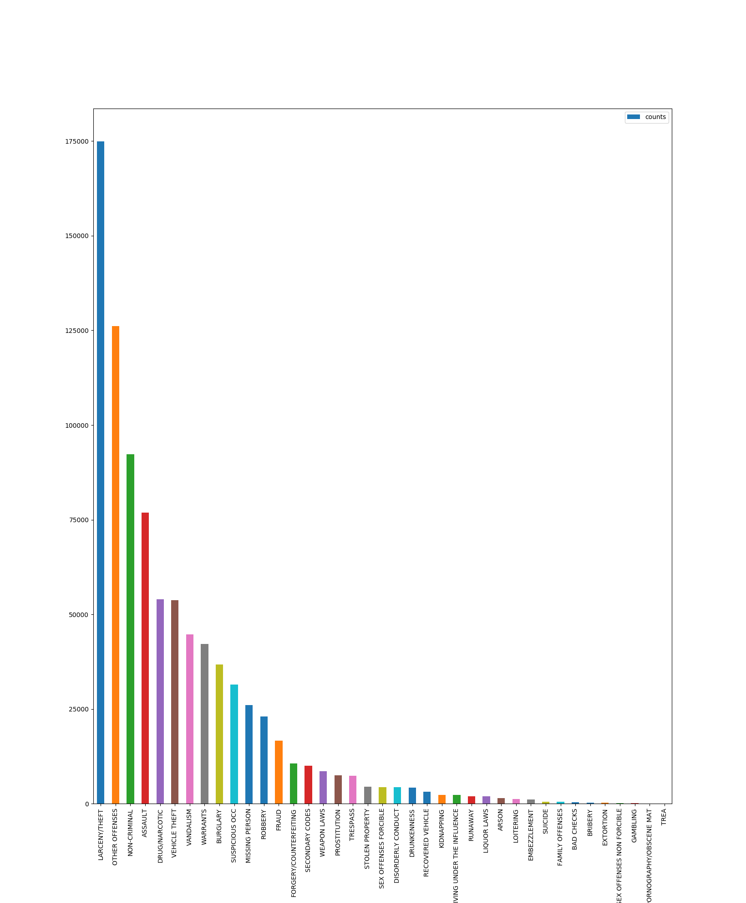
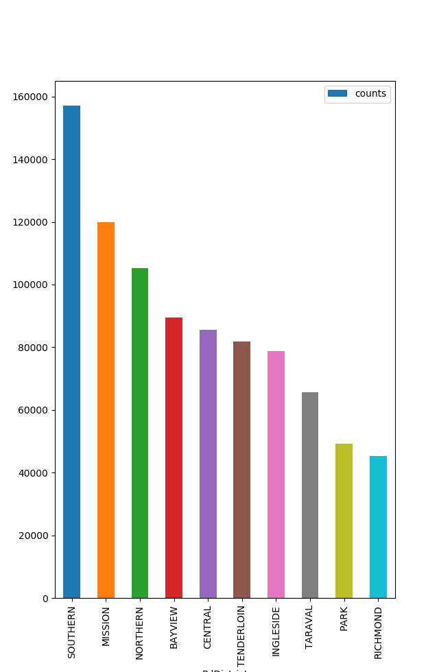

# 旧金山罪案类型预测
## 机器学习工程师纳米课程
宋潇宁
2018年12月20日
### 项目背景 
项目是Kaggle上的一个竞赛，该竞赛的目的是利用机器学习方法预测旧金山可能发生的犯罪类型。

1849年，随着加州淘金热的浪潮，旧金山经历了第一次繁荣，在随后的的几十年经历了城市面积激增和人口爆炸。人口的爆炸不可避免的带来了社会问题和高犯罪率，当然红灯区的存在也是一个很重要的原因[^1]。1934至1963年，旧金山因将一些罪行严重的罪犯关在恶魔岛而声名狼藉。而今因为很多高科技公司的存在，科技标签已经远远超过了其它标签的影响力。但是因为财富不均等、房屋短缺等因素，这里并不缺少犯罪[^2]。所以实现犯罪类型的预测对预防犯罪和降低犯罪带来的损失都能起到很大的作用。

[^1]: Yehya Abouelnaga, "San Francisco Crime Classification", The American University in Cairo, 2016
[^2]: San Francisco Crime Classification in Kaggle, https://www.kaggle.com/c/sf-crime

项目属于监督学习中的多标签分类问题。线性回归、KNN、朴素贝叶斯、决策树和随机森林机器学习算法对于特定的问题都能够实现非常不错的分类效果。

有人的地方就有可能有犯罪，因此通过机器学习帮助我们加深对犯罪发生模式的理解是对社会建设很有意义的一件事。更关键的是，对犯罪类型和犯罪率的预测能够帮助警察局更加有效的分配警力和打击犯罪率激增。

### 问题陈述
项目实质上就是一个监督学习的多分类问题，分类种类多达39种。训练集提供了9个特征，其中特征'Category'属于样本的标签。

项目需要使用机器学习算法通过训练集进行训练，最终得到一个可以根据特征预测犯罪类型的模型。

我将使用线性回归、KNN、朴素贝叶斯、决策树和随机森林机器学习算法对数据进行一个基本的学习，然后选择一个效果最好的模型进行优化。


### 数据集
数据集来源于Kaggle上名为旧金山罪案类型分类的竞赛[^3]，最原始的数据来源为[SF.OpenData](https://datasf.org/opendata/) [^4]。

数据集包含旧金山将近12年的详细犯罪记录，通过隔周抽取，将整个数据集分成了训练集和测试集，训练集包含878049个带标签样本，测试集包含884262个未带标签样本。

训练集中的每个样本都包含9个属性:
- Dates: 罪案发生的详细时间，格式：年-月-日 时-分-秒。
- Category: 罪案发生的类型，一共39个，这是我们要预测的目标。
- Descript: 罪案发生的详细描述。
- DayOfWeek: 罪案发生在一周的星期几。
- PdDistrict: 罪案发生的所属区域，一共10个。
- Resolution: 罪案的处理方式。
- Address: 罪案发生的街道地址。
- X: 罪案发生所在经度。
- Y: 罪案发生所在纬度。

测试集则去除了Category、Descript、Resolution属性，增加了ID属性。因此在训练模型时，我们将移除训练集中的Descript属性和Resolution属性。

[^3]: San Francisco Crime Classification Data. Kaggle. https://www.kaggle.com/c/sf-crime/data
[^4]: DataSF, https://data.sfgov.org/browse?q=Crime+Incident

### 解决方案陈述

XGBoost风靡Kaggle、天池、DataCastle、Kesci等国内外数据竞赛平台，是比赛夺冠的必备大杀器[^5]，因此我们采用XGBoost实现的提升树算法进行分类。

XGBoost均有如下特点[^5]：

1. 传统GBDT以CART作为基分类器，xgboost还支持线性分类器，这个时候xgboost相当于带L1和L2正则化项的逻辑斯蒂回归（分类问题）或者线性回归（回归问题）。
1. 传统GBDT在优化时只用到一阶导数信息，xgboost则对代价函数进行了二阶泰勒展开，同时用到了一阶和二阶导数。顺便提一下，xgboost工具支持自定义代价函数，只要函数可一阶和二阶求导。
1. xgboost在代价函数里加入了正则项，用于控制模型的复杂度。正则项里包含了树的叶子节点个数、每个叶子节点上输出的score的L2模的平方和。从Bias-variance tradeoff角度来讲，正则项降低了模型的variance，使学习出来的模型更加简单，防止过拟合，这也是xgboost优于传统GBDT的一个特性。
1. Shrinkage（缩减），相当于学习速率（xgboost中的eta）。xgboost在进行完一次迭代后，会将叶子节点的权重乘上该系数，主要是为了削弱每棵树的影响，让后面有更大的学习空间。实际应用中，一般把eta设置得小一点，然后迭代次数设置得大一点。（补充：传统GBDT的实现也有学习速率）
1. 列抽样（column subsampling）。xgboost借鉴了随机森林的做法，支持列抽样，不仅能降低过拟合，还能减少计算，这也是xgboost异于传统gbdt的一个特性。
1. 对缺失值的处理。对于特征的值有缺失的样本，xgboost可以自动学习出它的分裂方向。
1. xgboost工具支持并行。boosting不是一种串行的结构吗?怎么并行的？注意xgboost的并行不是tree粒度的并行，xgboost也是一次迭代完才能进行下一次迭代的（第t次迭代的代价函数里包含了前面t-1次迭代的预测值）。xgboost的并行是在特征粒度上的。我们知道，决策树的学习最耗时的一个步骤就是对特征的值进行排序（因为要确定最佳分割点），xgboost在训练之前，预先对数据进行了排序，然后保存为block结构，后面的迭代中重复地使用这个结构，大大减小计算量。这个block结构也使得并行成为了可能，在进行节点的分裂时，需要计算每个特征的增益，最终选增益最大的那个特征去做分裂，那么各个特征的增益计算就可以开多线程进行。
1. 可并行的近似直方图算法。树节点在进行分裂时，我们需要计算每个特征的每个分割点对应的增益，即用贪心法枚举所有可能的分割点。当数据无法一次载入内存或者在分布式情况下，贪心算法效率就会变得很低，所以xgboost还提出了一种可并行的近似直方图算法，用于高效地生成候选的分割点。

[^5]: XGBoost浅入浅出, http://wepon.me/2016/05/07/XGBoost%E6%B5%85%E5%85%A5%E6%B5%85%E5%87%BA/

### 基准模型
基准模型，即以最粗糙、最随意的方式预测分类，以多分类对数损失作为评判标准，建立模型基线，用于与优化后模型进行对比。

输入特征：
- Dates中的小时字段
- DayOfWeek
- PdDistrict
- Address中是否包含"Block"字段
- 经度
- 纬度

以上述6个特征作为模型的输入特征，以39个犯罪类型作为输出，训练2个模型作为基准模型。

模型：
- 随机模型
    对于训练集中的每个样本，随机从39个标签中选择一个作为预测结果，计算多分类对数损失。
- Logistic Regression
    缺省参数训练模型，计算多分类对数损失。

### 评估标准
使用多分类对数损失作为评估指标，公式如下：[^8]
$$ logloss = -\frac{1}{M}\sum_{i=1}^M{\sum_{j=1}^N{y_{ij}\log{p_{ij}}}} $$

- M: 数据集样本个数。
- N: 分类问题类别个数。
- $y_{ij}$: $j_{th}类别为$$i_{th}$真实类别时，$y_{ij}$为1，其余情况均为0。
- $p_{ij}$: 分类器预测$i_{th}$样本为$j_{th}$类别的概率。

损失函数y = -log(x)的函数图像如下：
.jpg)
从对数损失公式可以看出，只有分配给真实标签的概率会对损失值造成影响，假设模型预测错误，分配给真实标签的概率将会是一个比较小的数值，从函数图像中可以发现，概率越小得到的惩罚越大且增长迅速。反过来，模型预测正确，真实标签将得到一个比较大的数值，对于该样本则会返回一个非常小的损失值。

最大最小规则[^9]：
对于对数损失公式，$p_{ij}$为0或1时是没有意义的，因此通过引入一个极小值($\epsilon$)来杜绝这种情况的发生。公式如下：
```python
max(min(p, 1 - epsilon), epsilon)
```
根据题目要求，我们设置$\epsilon$为$10^{-15}$。

[^8]: sf-crime#evaluation， https://www.kaggle.com/c/sf-crime#evaluation
[^9]: MinMaxRule, http://wiki.fast.ai/index.php/Log_Loss

### 项目设计

- 数据可视化
    - 基于Dates，仅可视化基于小时的数据
    从下方图表中可以分析得出，犯罪案件的发生数量和时间段是有相关性的。图表中仅仅展示了小时和案件数量的相关性，在实践中还需要通过可视化分析出时间与犯罪案件类型的相关性，如在某个小时内发生A类型犯罪的概率远远高于其它犯罪类型。
    
    - 基于Category
    从下方图表中可以分析得出，39种犯罪类型的分布是很不平衡的。
    
    - 基于Day Of Week
    从下方图表中可以看出周五的犯罪案件数要多于其它时间，这可能和周五是分手日有关系[^1]。
    
    - 基于District
    从下方图表中可以看出某些社区的犯罪案件数明显高于其它社区。
    
    - 基于Address
    训练集中一共存在23228个地址，地址的分布非常的松散，不能直接拿来作为特征使用。我们将发生犯罪案件数量TOP20的地址绘制成条形图，如下。从数据中可以看出，在街区上发生犯罪的概率最高，即含有"Block"字段的地址。
    
    - 经纬度X,Y
    基于经纬度和犯罪类型，我们得到一张基于犯罪类型的密度图[^10]。
    

[^10]: DBenn: Crime Density by Location, https://www.kaggle.com/dbennett/test-map

- 数据预处理
    1. 确认训练数据是否存在缺失值并进行处理。
    1. 确认训练数据中数值类数据是否存在异常值并处理。
    1. 非数值特征尽量进行独热编码
        - 从Dates中解析出年、月、时三个字段并进行独热编码，得到49(13+12+24)个特征。
        - 将DayOfWeek进行独热编码，得到7个特征。
        - 将PdDistrict进行独热编码，得到10个特征。
    1. 将Address字段是否含有“Block”单词进行特征二值话，得到1个布尔特征。
    1. 使用KNN算法通过经纬度训练一个分类模型作为辅助模型，将输出的分类概率作为特征输入到主模型。

注：在项目实际优化中，可能会引入其它数据集来减少损失值。

- 算法选择
    待解决的是多分类问题，因此我们列举出多个支持多分类问题的算法并简单说明算法的优缺点，从直觉上选择三个分类算法作为待考察算法。
    - 朴素贝叶斯
        - 优点：
            1. 原理简单
            2. 收敛快速
        - 缺点：
            1. 该算法基于假设：所有特征都是条件独立的。
        我们的数据集中PdDistrict和基于坐标做的聚类是相关的。
    - 对数几率回归
        - 优点：
            1. 分类时计算量非常小，速度很快，存储资源低；
            1. 直接输出观测样本的概率；
        - 缺点：
            1. 仅能处理线性可分的数据集；
            1. 对于非线性特征必须进行转换；
    - SVM
        - 优点：
            1. 可以解决高维问题；
            1. 能够直接处理非线性特征；
        - 缺点：
            1. 效率很低；
            1. 天然不支持输出概率，如果需要，则性能会更低；
            1. 对于非线性特征，选择核函数很难；
    - XGBoost、随机森林
        XGBoost和随机森林都属于集成学习方法，目前集成学习大致可分为两大类，即个体学习器间存在强依赖关系、必须串行生成的序列化方法，以及个体学习器间不存在强依赖关系、可同时生成的并行化方法。XGBoost可以归属为前者，随机森林可以归属为后者。
        - 随机森林
            - 优点：
                1. 对于很多数据集表型良好，精确度较高；
                1. 不易过拟合；
                1. 可得到变量的重要性排序；
                1. 既能处理连续性数据也能处理离散型数据；
                1. 特征不需要做归一化；
                1. 易并行化；
            - 缺点：
                1. 噪声较大时容易过拟合；
        - XGBoost
            - 优点：
                1. 假如正则化项，正则化项的值和叶子结点个数、叶子结点得分正相关，因此在树的生成过程中就实现了剪枝优化；
                1. 对缺失值的处理。对于特征的值有缺失的样本，xgboost可以自动学习出它的分裂方向；
                1. 支持特征粒度上的并行处理；
                1. 列抽样，和随机森林中的属性扰动一样，即减少了计算又降低过拟合风险；
            - 缺点：
                1. 采用level-wise生长策略，带来不必要开销；（勉强算缺点吧）
                1. 采用pre-sorted算法，相比histogram算法内存消耗比较大[^20]；
                1. 随机内存访问较大，不进行优化的话会导致大量cache miss，降低效率[^20];

    XGBoost是优先使用算法。基于数据的特点和算法的优缺点，对数几率回归和随机森林也作为备选算法。如果上述三个算法经过优化后均得不到满意的结果，考虑使用深度学习算法进行训练。

### 参考文献
[^20]: 如何看待微软新开源的LightGBM?, https://www.zhihu.com/question/51644470