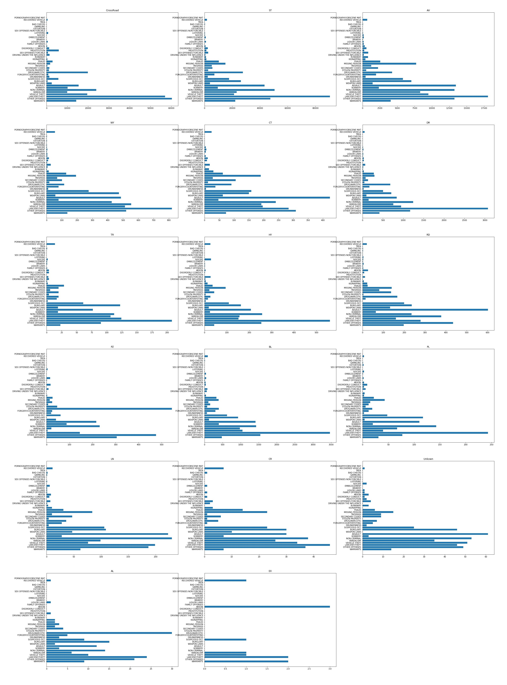
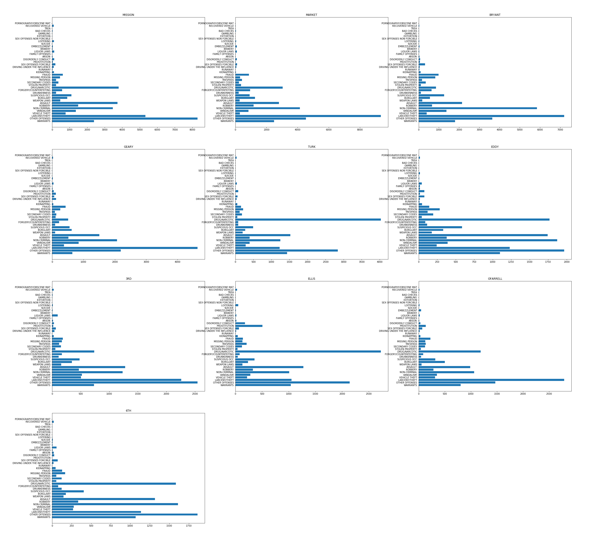

## 1 定义

### 1.1 项目概述
项目是Kaggle上的一个竞赛，该竞赛的目的是利用机器学习方法预测旧金山可能发生的案件类型。

1849年，随着加州淘金热的浪潮，旧金山经历了第一次繁荣，在随后的的几十年经历了城市面积激增和人口爆炸。人口的爆炸不可避免的带来了社会问题和高犯罪率，当然红灯区的存在也是一个很重要的原因[^1]。1934至1963年，旧金山因将一些罪行严重的罪犯关在恶魔岛而声名狼藉。而今因为很多高科技公司的存在，科技标签已经远远超过了其它标签的影响力。但是因为财富不均等、房屋短缺等因素，这里并不缺少犯罪[^2]。所以实现案件类型的预测对预防犯罪和降低犯罪带来的损失都能起到很大的作用。

[^1]: Yehya Abouelnaga, "San Francisco Crime Classification", The American University in Cairo, 2016
[^2]: San Francisco Crime Classification in Kaggle, https://www.kaggle.com/c/sf-crime

项目属于监督学习中的多标签分类问题。线性回归、KNN、朴素贝叶斯、决策树和随机森林机器学习算法对于特定的问题都能够实现非常不错的分类效果。

有人的地方就有可能有犯罪，因此通过机器学习帮助我们加深对犯罪发生模式的理解是对社会建设很有意义的一件事。更关键的是，对案件类型和犯罪率的预测能够帮助警察局更加有效的分配警力和打击犯罪率激增。

### 1.2 问题陈述

项目实质上就是一个监督学习的多分类问题，分类种类多达39种。训练集提供了9个特征，其中特征'Category'属于样本的标签。

项目需要使用机器学习算法通过训练集进行训练，最终得到一个可以根据特征预测案件类型的模型。

我将使用随机森林和XGBoost中的提升树两种机器学习算法对数据进行一个基本的学习，然后选择一个效果最好的模型进行优化。


### 1.3 评价指标

使用多分类对数损失作为评估指标，公式如下[^3]：
$$ logloss = -\frac{1}{M}\sum_{i=1}^M{\sum_{j=1}^N{y_{ij}\log{p_{ij}}}} $$

- M: 数据集样本个数。
- N: 分类问题类别个数。
- $y_{ij}$: $j_{th}类别为$$i_{th}$真实类别时，$y_{ij}$为1，其余情况均为0。
- $p_{ij}$: 分类器预测$i_{th}$样本为$j_{th}$类别的概率。

损失函数y = -log(x)的函数图像如下：
<div align="center">
<br>图1：y = -log(x)函数图像
</div>
从对数损失公式可以看出，只有分配给真实标签的概率会对损失值造成影响，假设模型预测错误，分配给真实标签的概率将会是一个比较小的数值，从函数图像中可以发现，概率越小得到的惩罚越大且增长迅速。反过来，模型预测正确，真实标签将得到一个比较大的数值，对于该样本则会返回一个非常小的损失值。

最大最小规则[^4]：
对于对数损失公式，$p_{ij}$为0或1时是没有意义的，因此通过引入一个极小值($\epsilon$)来杜绝这种情况的发生。公式如下：
```python
max(min(p, 1 - epsilon), epsilon)
```
根据题目要求，我们设置$\epsilon$为$10^{-15}$。

[^3]: sf-crime#evaluation， https://www.kaggle.com/c/sf-crime#evaluation
[^4]: MinMaxRule, http://wiki.fast.ai/index.php/Log_Loss

## 2 分析

### 2.1 数据探索
数据集来源于Kaggle数据竞赛网站[^5]的“San Francisco Crime Classification”项目[^6]，最原始的数据来源为"SF.OpenData"[^7]。数据集包含旧金山将近12年的详细犯罪记录，通过隔周抽取，将整个数据集分成了训练集和测试集，训练集包含878049个带标签样本，测试集包含884262个未带标签样本。训练集每个样本含有8个特征和1个目标分类，分别为：Dates、Category、Descript、DayOfWeek、PdDistrict、Resolution、Address、X、Y，其中Category为目标分类。  

训练集字段详细信息如下：
- Dates: 罪案发生的详细时间，格式：年-月-日 时-分-秒。(标准时间格式字符串)
- Category: 罪案发生的类型，一共39个，这是我们要预测的目标。(字符串)
- Descript: 罪案发生的详细描述。(字符串)
- DayOfWeek: 罪案发生在一周的星期几。(字符串)
- PdDistrict: 罪案发生的所属区域，一共10个。(字符串)
- Resolution: 罪案的处理方式。(字符串)
- Address: 罪案发生的街道地址。(字符串)
- X: 罪案发生所在经度。(数字)
- Y: 罪案发生所在纬度。(数字)

其中Dates字段可以解析为年、月、日、时四个特征独立使用，分和秒太过于精细，舍弃不用。Descript、Resolution只是两个文字描述，无任何参考意义，舍弃不用。

Address字段分为几种特定的填写格式。
- "200 Block of INTERSTATE80 HY"，解析："200"为道路编号，"INTERSTATE80"为道路名称，"HY"为道路类型后缀。
- "STCHARLES AV / 19TH AV"，解析："STCHARLES"和"19TH"均为道路名称，"AV"为道路类型后缀。这种地址格式被认为是路口。
- "0 Block of AVENUE OF THE PALMS"，解析："0"为道路编号，"AVENUE"为道路类型全称。这种类型的地址个人被认为无法解析出道路名称。

从Address地址中根据上述三种格式进行解析可以得到道路类型、道路名称、道路编号。三个特征由粗到细对地址进行三个维度的分类。道路类型包括街道、林荫大道、小巷、高速铁路等等，不同的道路类型，案件类型数量的分布一般也会不同。而一般同一条道路消费人群、居住人群的学历、收入、消费能力、工作性质都会有一些相似性，同时道路上的商店类型、是否有大量银行分布都会影响到案件类型数的分布，所以可以推断，对于不同的道路案件类型数分布也会不同。道路编号则直接定位到了具体的门牌号，假设该门牌号对应的是银行，则发生抢劫案件的数量会更多。

如果可以引入新的数据集可以根据道路名称、道路编号得到该道路的关联信息，如：居住人群的学历、收入、消费能力等等，应该能够提高识别度。当然没有该数据，仅仅依赖道路类型、道路名称、道路编号也会有提高。

上述提到的道路名称可能存在重名，如：主城区和恶魔岛存在重名的道路，对于这种情况，经纬度特征可以提供更加细致的分类。

图XX展示的是对训练集非空值和空字符串的统计，其中非空值统计使用`pandas.DataFrame.count()`接口，空字符串数则是统计字符串类特征中`""`的数量。通过观察可以得出训练集中没有缺失值。
<div align="center">
<br>图2：训练集缺失值统计
</div>

对于异常值处理，则仅需要对表示经纬度的"X"，"Y"两个特征进行一个约束。

[^5]: Kaggle数据竞赛网站, https://www.kaggle.com/
[^6]: sf-crime, https://www.kaggle.com/c/sf-crime
[^7]: DataSF, https://data.sfgov.org/browse?q=Crime+Incident

### 2.2 数据可视化
图5以柱状图的方式清晰的展示出训练集各种案件类型数量的分布图，数据集很不平衡，大量的样本集中在少量的几种案件类型上。像"TREA"仅仅只有6个样本，我也完全没搞清楚这到底是什么罪行。由于我们的训练集和测试集是隔周抽取的，如果某种案件类型存在明显的时间周期特性，很有可能会大大提高模型预测的难度。
<div align="center">
<br>图5：整体案件类型数量分布图
</div>
由于案件类型很不平衡，我们以比较大的粒度划分数据集后得到数据集案件数量分布变化可能不会太大。比如图4所绘制的是凌晨五点案件类型数量的分布图，和图5的分布基本一致。数据的不平衡还带来了另一个困惑，图3展示的是各种案件类型数量随着时间推移的分布图，我们可以看到大部分案件类型的数量在凌晨五点达到最低点，随着时间的后移数量逐步增加，在中午或者傍晚达到顶峰。而案件类型"DISORDERLY CONDUCT"的数量在凌晨五点达到了巅峰。这本来可以作为一个很好的区分点，但是图四已经像我们展示了凌晨五点的分布图，由于数据集的不平衡，单单凌晨五点"DISORDERLY CONDUCT"数量激增这个特征起不到什么作用。因此我们需要更加细粒度的特征。

<div align="center">
<br>图3：以小时为横轴39种案件类型数量分布图
</div>

<div align="center">
<br>图4：凌晨五点案件类型数量分布图
</div>


数据探索时曾提到从Address中可以提取到道路编号，道路名称、道路类型。从直觉上分析，同一种道路类型、同一条道路、同一条道路了的同一个道路编号发生的案件类型数量分布应该是一致的，而且三个特征不同时，应该可以得到各具特色的数量分布。图6展示的是基于道路类型39种案件类型数量的分布图，可以看出分布已经发生了变化，"LARCENY/THEFT"不再永远占据第一位，其它的一些犯罪类型数量分布也发生了波动。

<div align="center">
<br>图6：按道路类型(后缀)粒度39种案件类型数量分布图
</div>

图7展示的是按道路名称筛选，样本个数TOP10的案件类型数量分布。从图片中可以看出每个道路的分布都不一样。

<div align="center">
<br>图7：按道路名称粒度39种案件类型数量分布图(TOP10)
</div>

图8展示的是道路名称"HAIGHT"基于道路编号划分的案件类型数量分布。此时每个图片均体现出不同的数量分布。
<div align="center">
<br>图7：道路名称"HAIGHT"基于道路编号划分的案件类型数量分布图
</div>

### 2.3 算法与技术
该问题属于一个多分类、大数据集问题，因此我们采用两个表现一直非常好的算法，随机森林和提升树。其中随机森林使用scikit-learn包[^8]中的算法。提升树则使用竞赛界享有盛名的XGBoost库[^9]。两个算法都支持一定的并行计算，因此在性能上会表现不错。

下面简单描述一下两个算法的优缺点:
- 随机森林
    优点：
     - 对于不平衡的数据集，可以平衡误差。
     - 每颗子树都可以独立训练，易于并行化。
     - 弥补了决策树容易过拟合的缺陷且效率也很高。
     - 训练时可以同时进行列选样和行选样。
    
    缺点
     - 黑盒子，只能通过不同的参数和种子进行尝试来找到合适模型。

- XGBoost
    优点：
    - XGBoost对代价函数进行了二阶泰勒展开，同时用到了一阶和二阶导数。并且支持自定义代价函数。
    - XGBoost在代价函数里加入了正则项，用于控制模型的复杂度。正则项包含两个惩罚因子，分别惩罚叶子结点个数和叶子结点权重。可以很好的预防过拟合。 惩罚想公式如下：
        $$ \Omega(f_{t}) = \gamma T + \frac{1}{2} \lambda \sum_{j=1}^{T} w_{j}^2  $$
        其中`T`表示叶子结点个数，`w`表示叶子结点权重值。
    - Shrinkage，通过衰减因子可以降低每颗树之间的相互影响，增大学习空间以便产生更多的树。
    - XGBoost借鉴随机森林的方法，同样支持列抽样。
    - 虽然XGBoost的提升树在树与树之间只能串行操作，但是在生成树的过程中需要对样本进行排序和计算分裂点收益，这两步都实现了并行操作。且当数据集超过内存大小时，XGBoost还支持基于外存的计算。
    - 计算分裂点收益时，XGBoost支持近似直方图算法，可以近似找到最合适的分裂点，较少计算提高性能。
    - 对于缺失值可以自动学习出它的分裂方向。（通过将缺失值全部分左、分右，计算两次增益的大小来决策）

    缺点：
    - 代码BUG不少，使用动态学习速率时会出现内存泄露。
    - 文档不像scikit-learn那么完备。
    - 黑盒子，只能通过不同的参数和种子进行尝试来找到合适模型。

首先使用两个机器学习算法分别对训练集进行学习并计算，绘制学习曲线，选出最合适的机器学习算法进行进一步优化。

[^8]: scikit-learn, https://scikit-learn.org/stable/index.html
[^9]: XGBoost, https://xgboost.ai/


### 2.4 基准模型
基准模型，即以最粗糙、最随意的方式预测分类，以多分类对数损失作为评判标准，建立模型基线，用于与优化后模型进行对比。
- 基准模型一
    以Dates中的小时字段、DayOfWeek、PdDistrict、Address中是否包含Block字段、经度、纬度作为模型的输入特征，以39种案件类型作为输出，使用Logistic Regression分类算法训练模型，使用得到的模型对测试集进行预测，提交网站并计算多分类对数损失。以该损失值作为基准。  
      
    网站得分：2.71573

- 基准模型二
    以Kaggle网站该项目的Public Leaderboard排名为基准，争取能力范围内最高的排名。如图8所示：
    <div align="center">
    <br>图8：Kaggle网站上的Public Leaderborad排名
    </div>

## 3 方法

### 3.1 数据预处理

**缺失值处理：**
通过`(train_data.isnull().any(axis=0) == False).all()`和`(train_data.isna().any(axis=0) == False).all()`两行代码判断训练集中是否存在缺失值。返回`True`则不存在缺失值，否则存在。

如果存在缺失值，可以使用scikit-learn包中的impute模块进行处理，该模块提供了多种策略进行缺失值填充。当然在样本充足的情况下，可以直接删除具有缺失值的样本。由于我们准备使用的两个算法均对缺失值不敏感，因此我们可以不处理缺失值。

经过验证，训练集中不存在缺失值。

**异常值处理：**
训练集中只有经纬度两个特征属于数字类特征，其余处时间外都是字符串类，因此不需要考虑是否存在异常值。设置旧金山地区经纬度边界值为-122.52, -122.35, 37.70, 37.85。使用该限制条件过滤一下训练集即可。

**特征扩展：**
- `Dates`字段解析成Year/Month/Day/Hour四个特征使用。
- `Address`字段解析成RoadBlock/RoadName1/RoadName2/RoadType/HasBlock五个特征使用。

其中在`Address`字段的解析过程中，无法识别的类型均赋值为Unkown。

随机森林和提升树两种算法均对特征的范围、大小，分布等统计信息不敏感，因此不需要做归一化等特殊处理。只需要将DayOfWeek/PdDistrict/RoadBlock/RoadName1/RoadName2编码为数字即可。

经过预处理后，训练模型时将使用的特征如下：  `X/Y/Year/Month/Day/Hour/DayOfWeekID/PdDistrictID/HasBlock/RoadTypeID/RoadBlockID/RoadName1ID/RoadName2ID`

### 3.2 实现

对于随机森林，设置`max_depth=6 random_state=10`，其它参数使用缺省值，在全量训练集上跑一次，用于得到训练全量训练集需要的时间。如果时间太久，为了节约时间，使用网格搜索方法寻找最优超参数时就不适用全量训练集，找到最优参数后，再用全量训练集训练一次即可。通过测试发现仅需要10秒钟，因此直接使用全量训练集即可。

使用10折交叉验证和网格搜索法寻找随机森林最优的超参数。遍历的超参数和对应的数值如下：
- n_estimators: start=200, end=1500, step=200
- criterion: "gini", "entropy"
- max_depth: start=6, end=11, step=1
- min_samples_split: start=20, end=51, step=10
- max_features: start=0.5, end=1.1, step=0.1
- bootstrap: True, False

如果直接按照上述网格参数，再结合10折交叉验证，一共需要训练`33600`(7 * 2 * 5 * 4 * 6 * 2 * 10)个模型。按照10秒钟训练一个模型，将需要将近100个小时，我们无法承受这个时间消耗，因此改变为如下近似策略。

进行多次网格搜索，每次仅尝试搜索上述一个参数，将得到的最优参数作为结果。每次进行网格搜索时，除目标参数外，已经找到最优参数的直接使用，还没有找到的随心填写一个即可，或者直接使用缺省值。在这种策略下，计算模型个数公式中的乘法便变成了加法(最后一个乘号不变)。仅仅需要训练`260`((7 + 2 + 5 + 4 + 6 + 2) * 10)个模型，大大缩短了训练时间。

### 3.3 改进