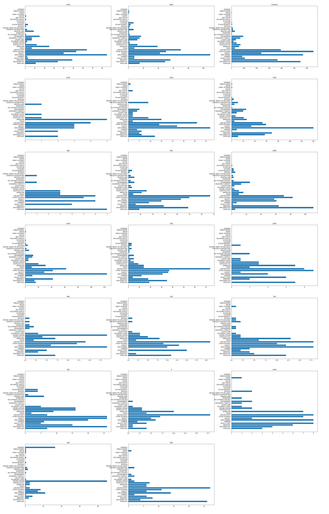

# 旧金山罪案类型预测

#### 宋潇宁
#### 2019年1月31号

## 1 定义

### 1.1 项目概述
项目是Kaggle上的一个竞赛，该竞赛的目的是利用机器学习预测旧金山可能发生的案件类型。

1849年，随着加州淘金热的浪潮，旧金山经历了第一次繁荣，在随后的的几十年经历了城市面积激增和人口爆炸。人口的爆炸不可避免的带来了社会问题和高犯罪率，当然红灯区的存在也是一个很重要的原因[^1]。1934至1963年，旧金山则因将一些罪大恶极的罪犯关在恶魔岛而声名狼藉。而今因为很多高科技公司的存在，科技标签已经远远超过了其它标签的影响力。但是因为财富不均等、房屋短缺等因素，这里并不缺少犯罪[^2]。所以实现案件类型的预测对预防犯罪和降低犯罪带来的损失都能起到很大的作用。

[^1]: Yehya Abouelnaga, "San Francisco Crime Classification", The American University in Cairo, 2016
[^2]: San Francisco Crime Classification in Kaggle, https://www.kaggle.com/c/sf-crime

项目属于监督学习中的多标签分类问题。线性回归、KNN、朴素贝叶斯、决策树和随机森林等多种机器学习算法对该类问题都能够实现非常不错的分类效果。但是犯罪分析本身就是一个极其复杂的问题，理论上的变量非常多而且这些变量状态很难获取或者量化，比如犯罪者的情绪。而情绪同时也会受到各种因素的影响。

俗话讲，有人的地方就有江湖，而江湖中必有犯罪的发生。因此通过机器学习帮助我们加深对犯罪发生模式的理解是对社会建设很有意义的一件事。更关键的是，对案件类型和犯罪率的预测能够帮助警察局更加有效的分配警力和打击犯罪率激增。

### 1.2 问题陈述

项目实质上就是一个**监督学习的多分类问题**，分类种类多达39种。训练集提供了9个特征，其中特征'Category'属于样本的标签。问题的目标是通过机器学习算法训练一个可以预测犯罪类型的模型。

我将使用随机森林和XGBoost的梯度提升树两种机器学习算法进行训练，通过交叉验证、网格搜索等方法找到两种模型的最优参数，最后根据两种模型的得分决定选择出合适的学习算法。

### 1.3 评价指标

使用多分类对数损失作为评估指标，公式如下[^3]：
$$ logloss = -\frac{1}{M}\sum_{i=1}^M{\sum_{j=1}^N{y_{ij}\log{p_{ij}}}} $$

- M: 数据集样本个数。
- N: 分类问题类别个数。
- $y_{ij}$: $j_{th}类别为$$i_{th}$真实类别时，$y_{ij}$为1，其余情况均为0。
- $p_{ij}$: 分类器预测$i_{th}$样本为$j_{th}$类别的概率。

损失函数y = -log(x)的函数图像如图1所示：
<div align="center">
<br>图1：y = -log(x)函数图像
</div>
从对数损失公式可以看出，只有分配给真实标签的概率会对损失值造成影响，假设模型预测错误，分配给真实标签的概率将会是一个比较小的数值，从函数图像中可以发现，概率越小得到的惩罚越大且增长迅速。反过来，模型预测正确，真实标签将得到一个比较大的数值，对于该样本则会返回一个非常小的损失值。

最大最小规则[^4]：
对于对数损失公式，$p_{ij}$为0或1时是没有意义的，因此通过引入一个极小值($\epsilon$)来杜绝这种情况的发生。公式如下：
```python
max(min(p, 1 - epsilon), epsilon)
```
根据题目要求，我们设置$\epsilon$为$10^{-15}$。

[^3]: sf-crime#evaluation， https://www.kaggle.com/c/sf-crime#evaluation
[^4]: MinMaxRule, http://wiki.fast.ai/index.php/Log_Loss

## 2 分析

### 2.1 数据探索
数据集来源于Kaggle数据竞赛网站[^5]的“San Francisco Crime Classification”项目[^6]，最原始的数据来源则为"SF.OpenData"[^7]。数据集包含旧金山将近12年的详细犯罪记录，通过隔周抽取，将整个数据集分成了训练集和测试集，训练集包含878049个带标签样本，测试集包含884262个未带标签样本。训练集每个样本含有8个特征和1个目标分类，分别为：Dates、Category、Descript、DayOfWeek、PdDistrict、Resolution、Address、X、Y，其中Category为目标分类。  

训练集字段详细信息如下：
- Dates: 罪案发生的详细时间，格式：年-月-日 时-分-秒。(标准时间格式字符串)
- Category: 罪案发生的类型，一共39个，这是我们要预测的目标。(字符串)
- Descript: 罪案发生的详细描述。(字符串)
- DayOfWeek: 罪案发生在一周的星期几。(字符串)
- PdDistrict: 罪案发生的所属区域，一共10个。(字符串)
- Resolution: 罪案的处理方式。(字符串)
- Address: 罪案发生的街道地址。(字符串)
- X: 罪案发生所在经度。(数字)
- Y: 罪案发生所在纬度。(数字)

其中Dates字段可以解析为年、月、日、时四个特征独立使用，分和秒太过于精细，舍弃不用。Descript、Resolution只是两个文字描述，无任何参考意义，舍弃不用。

Address字段分为几种特定的填写格式。
- "200 Block of INTERSTATE80 HY"，解析："200"为道路编号，"INTERSTATE80"为道路名称，"HY"为道路类型后缀。
- "STCHARLES AV / 19TH AV"，解析："STCHARLES"和"19TH"均为道路名称，"AV"为道路类型后缀。这种地址格式被认为是路口。
- "0 Block of AVENUE OF THE PALMS"，解析："0"为道路编号，"AVENUE"为道路类型全称。这种类型的地址个人被认为无法解析出道路名称。

从Address地址中根据上述三种格式进行解析可以得到道路类型、道路名称、道路编号。三个特征由粗到细对地址进行三个维度的分类。道路类型包括街道、林荫大道、小巷、高速铁路等等，不同的道路类型，案件类型数量的分布一般也会不同。而一般同一条道路消费人群、居住人群的学历、收入、消费能力、工作性质都会有一些相似性，同时道路上的商店类型、是否有大量银行分布都会影响到案件类型数的分布，所以可以推断对于不同的道路案件类型数分布也会不同。道路编号则直接定位到了具体的门牌号，假设该门牌号对应的是银行，则发生抢劫案件的数量会更多。

如果可以找到新的数据集包含道路名称、道路编号的关联信息，如：居住人群的学历、收入、消费能力等等，应该能够提高识别度。当然没有该数据，仅仅依赖道路类型、道路名称、道路编号也会有提高。

上述提到的道路名称可能存在重名，如：主城区和恶魔岛存在重名的道路，对于这种情况，经纬度特征可以提供更加细致的分类。

图2是对训练集非空值和空字符串的统计，其中非空值统计使用`pandas.DataFrame.count()`接口，空字符串数则是统计字符串类特征中`""`的数量。通过观察可以得出训练集中没有缺失值。
<div align="center">
<br>图2：训练集缺失值统计
</div>

对于异常值处理，则仅需要对表示经纬度的"X"，"Y"两个特征进行一个约束。

[^5]: Kaggle数据竞赛网站, https://www.kaggle.com/
[^6]: sf-crime, https://www.kaggle.com/c/sf-crime
[^7]: DataSF, https://data.sfgov.org/browse?q=Crime+Incident

### 2.2 数据可视化
图3以柱状图的方式清晰的展示出训练集各种案件类型数量的分布图，数据集很不平衡，大量的样本集中在少量的几种案件类型上。像"TREA"仅仅只有6个样本，我也完全没搞清楚这到底是什么罪行。由于我们的训练集和测试集是隔周抽取的，如果某种案件类型存在明显的时间周期特性，很有可能会大大提高模型预测的难度。
<div align="center">
<br>图3：整体案件类型数量分布图
</div>

<div align="center">
<br>图4：凌晨五点案件类型数量分布图
</div>

由于案件类型很不平衡，我们以比较大的粒度划分数据集后得到数据集案件数量分布变化可能不会太大。比如图4所绘制的是凌晨五点案件类型数量的分布图，和图3的分布基本一致。数据的不平衡还带来了另一个困惑，图5展示的是各种案件类型数量随着时间推移的分布图，我们可以看到大部分案件类型的数量在凌晨五点达到最低点，随着时间的后移数量逐步增加，在中午或者傍晚达到顶峰。而案件类型"DISORDERLY CONDUCT"的数量在凌晨五点达到了巅峰。这本来可以作为一个很好的区分点，但是图4已经展示了凌晨五点的分布图，由于数据集的不平衡，单单凌晨五点"DISORDERLY CONDUCT"数量激增这个特征起不到什么作用。因此我们需要更加细粒度的特征。

<div align="center">
<br>图5：以小时为横轴39种案件类型数量分布图
</div>

数据探索时曾提到从Address中可以提取到道路编号，道路名称、道路类型。从直觉上分析，同一种道路类型、同一条道路、同一条道路了的同一个道路编号发生的案件类型数量分布应该是一致的，而且三个特征不同时，应该可以得到各具特色的数量分布。图6展示的是基于道路类型39种案件类型数量的分布图，可以看出分布已经发生了变化，"LARCENY/THEFT"不再永远占据第一位，其它的一些犯罪类型数量分布也发生了波动。

<div align="center">
<br>图6：按道路类型(后缀)粒度39种案件类型数量分布图
</div>


图7展示的是按道路名称筛选，样本个数TOP10的案件类型数量分布。从图片中可以看出每个道路的分布都不一样。

<div align="center">
<br>图7：按道路名称粒度39种案件类型数量分布图(TOP10)
</div>

图8展示的是道路名称"HAIGHT"基于道路编号划分的案件类型数量分布。此时每个图片均体现出不同的数量分布。
<div align="center">
<br>图8：道路名称"HAIGHT"基于道路编号划分的案件类型数量分布图
</div>

### 2.3 算法与技术
该问题属于一个多分类、大数据集问题，因此我们采用两个表现一直非常好的算法，随机森林和梯度提升树。其中随机森林使用scikit-learn包[^8]中的算法。梯度提升树则使用竞赛界享有盛名的XGBoost库[^9]。两个算法都支持一定的并行计算，因此在性能上会表现不错。

下面简单描述一下两个算法的优缺点:
- 随机森林
    优点：
     - 对于不平衡的数据集，可以平衡误差。
     - 每颗子树都可以独立训练，易于并行化。
     - 弥补了决策树容易过拟合的缺陷且效率也很高。
     - 训练时可以同时进行列选样和行选样。
    
    缺点
     - 黑盒子，只能通过不同的参数和种子进行尝试来找到合适模型。

- XGBoost
    优点：
    - XGBoost对代价函数进行了二阶泰勒展开，同时用到了一阶和二阶导数。并且支持自定义代价函数。
    - XGBoost在代价函数里加入了正则项，用于控制模型的复杂度。正则项包含两个惩罚因子，分别惩罚叶子结点个数和叶子结点权重。可以很好的预防过拟合。 惩罚想公式如下：
        $$ \Omega(f_{t}) = \gamma T + \frac{1}{2} \lambda \sum_{j=1}^{T} w_{j}^2  $$
        其中`T`表示叶子结点个数，`w`表示叶子结点权重值。
    - Shrinkage，通过衰减因子可以降低每颗树之间的相互影响，增大学习空间以便产生更多的树。
    - XGBoost借鉴随机森林的方法，同样支持列抽样。
    - 虽然XGBoost的梯度提升树在树与树之间只能串行操作，但是在生成树的过程中需要对样本进行排序和计算分裂点收益，这两步都实现了并行操作。且当数据集超过内存大小时，XGBoost还支持基于外存的计算。
    - 计算分裂点收益时，XGBoost支持近似直方图算法，可以近似找到最合适的分裂点，较少计算提高性能。
    - 对于缺失值可以自动学习出它的分裂方向。（通过将缺失值全部分左、分右，计算两次增益的大小来决策）

    缺点：
    - 代码BUG不少，使用动态学习速率时会出现内存泄露。
    - 文档不像scikit-learn那么完备。
    - 黑盒子，只能通过不同的参数和种子进行尝试来找到合适模型。

同时使用两种学习算法进行训练、调参，最终选择结果最好的模型。

[^8]: scikit-learn, https://scikit-learn.org/stable/index.html
[^9]: XGBoost, https://xgboost.ai/


### 2.4 基准模型
基准模型，即以最粗糙、最随意的方式预测分类，以多分类对数损失作为评判标准，建立模型基线，用于与优化后模型进行对比。
- 基准模型一
    以Dates中的小时字段、DayOfWeek、PdDistrict、Address中是否包含Block字段、经度、纬度作为模型的输入特征，以39种案件类型作为输出，使用Logistic Regression分类算法训练模型，使用得到的模型对测试集进行预测，提交网站并计算多分类对数损失。以该损失值作为基准。  
      
    网站得分：2.71573

- 基准模型二
    以Kaggle网站该项目的Public Leaderboard排名为基准，争取能力范围内最高的排名。如图8所示：
    <div align="center">
    <br>图10：Kaggle网站上的Public Leaderborad排名
    </div>

## 3 方法

### 3.1 数据预处理

**缺失值处理：**
通过`(train_data.isnull().any(axis=0) == False).all()`和`(train_data.isna().any(axis=0) == False).all()`两行代码判断训练集中是否存在缺失值。返回`True`则不存在缺失值，否则存在。

如果存在缺失值，可以使用scikit-learn包中的impute模块进行处理，该模块提供了多种策略进行缺失值填充。当然在样本充足的情况下，可以直接删除具有缺失值的样本。由于我们准备使用的两个算法均对缺失值不敏感，因此我们可以不处理缺失值。

经过验证，训练集中不存在缺失值。

**异常值处理：**
训练集中只有经纬度两个特征属于数字类特征，其余处时间外都是字符串类，因此不需要考虑是否存在异常值。设置旧金山地区经纬度边界值为-122.52, -122.35, 37.70, 37.85。使用该限制条件过滤一下训练集即可。

**特征扩展：**
- `Dates`字段解析成Year/Month/Day/Hour四个特征使用。
- `Address`字段解析成RoadBlock/RoadName1/RoadName2/RoadType/HasBlock五个特征使用。

其中在`Address`字段的解析过程中，无法识别的类型均赋值为Unkown。

随机森林和梯度提升树两种算法均对特征的范围、大小，分布等统计信息不敏感，因此不需要做归一化等特殊处理。只需要将DayOfWeek/PdDistrict/RoadBlock/RoadName1/RoadName2编码为数字即可。

经过预处理后，训练模型时将使用的特征如下：  `X/Y/Year/Month/Day/Hour/DayOfWeekID/PdDistrictID/HasBlock/RoadTypeID/RoadBlockID/RoadName1ID/RoadName2ID`

### 3.2 实现

首先实现了两个队Address字段进行解析的函数：`extra_address_for_suffix`和`extra_address_for_infos`，分别用来解析出道路类型、道路名称、道路编号。其中设计到交叉路口时，道路名称会解析出两个。而对于道路类型，交叉路口直接解析为"CrossRoad"。对于无法解析出的内容均赋值为"Unkown"。

由于数据集很大，交叉验证和网格搜索需要耗费很长的时间，因此实现函数`dataset_sample`对训练集进行采样，采样原则为：定义frac为采样比例，类别样本数*frac大于10则按采样比例随机采样，否则采集全部样本。这样既最大限度保留原训练集的分布同时样本类别数也没有减少。

随机森林和XGBoost均直接采用第一直觉参数值进行全训练集训练，然后将训练得到的两个模型作用于训练集，上传得到的预测结果到网站，得到训练集得分。

随机森林参数：
- "n_estimators": 500
- "max_depth": 8
- "min_samples_split": 20
- "max_features": 0.8
其余参数均是缺省值，使用训练得到的模型对测试集进行预测并上传至Kaggle网站，得分为：2.40945

XGBoost.XGBClassifier参数：
- "learning_rate": 0.1
- "n_estimators": 200
- "max_depth": 5
- “tree_method”: hist
- "colsample_bytree": 0.5
- "gamma": 0.2
- "subsapmle": 0.5
其余参数均是缺省值，使用训练得到的模型对测试集进行预测并上传至Kaggle网站，得分为：2.36528

在使用XGBoost过程中遇到了不少问题，并且由于时间比较紧迫加上对XGB的原理还没有摸透，因此只能用其他的办法绕开这些问题进行往下走，但是也消耗了很多的时间和精力。列举部分问题：（也不一定框架问题，可能是使用不当，在xgboost的官方论坛发了疑问并没有得到回复，毕业项目搞完下决心定位一下这些问题）
1. 使用GPU算法时，训练得到模型无论是直接预测测试集还是保存加载后再使用，都会因此异常，怀疑是内存不足了。
1. 使用GPU算法没找到办法进行叠加训练。
1. 使用CPU算法，learning_rate传入python列表后，C++代码存在内存泄露，很快16G内存就耗光了。
1. 使用GPU算法是，使用eta和callback传入学习速率训练得到的模型区别较大。 

从上述两个得分来看，XGBoost是明显优于随机森林模型的。

### 3.3 改进
首先无论是随机森林还是XGBoost，直接在全量训练集上进行交叉验证和网格搜索所需要的时间都是难以接受的，经过测试随着树个数的增加，一个模型的训练时间会达到几十分钟，因此直接使用完整数据集得到一次结果可能需要几天的时间。

因此我们采用这种的方法，使用自己实现的`dataset_sample`函数从训练集中进行采样，采样结果尽量保证了如下两点数据集特征： 
- 数据集中各类别的样本比例尽量保证一致。
- 对于样本数极少的类别（如几十个样本）全量保留。 

在对随机森林和XGBoost进行调参时，采样比例定位`0.1`。

#### 3.3.1 随机森林

由于训练集中存在一个类别的样本数过少，数量仅为6，因此采用5折交叉验证和网格搜索法寻找随机森林最优的超参数。 
需要遍历的超参数和对应的数值如下：
- n_estimators: start=1000, end=4001, step=500
- criterion: "gini", "entropy"
- max_depth: start=6, end=11, step=1
- min_samples_split: start=20, end=101, step=10
- max_features: start=0.5, end=1.1, step=0.1
- bootstrap: True, False

如果直接按照上述网格参数进行5折网格搜索，一共需要训练`75600`(7 * 2 * 5 * 9 * 6 * 2 * 5)个模型。即使我们已经使用了小数据集，但是训练时间也是无法接受的，因此我们采用近似策略寻找最优参数，调参过程如下：
1. 设置一组基础参数，`max_depth=6, n_estimators=200, criterion="entropy", min_samples_split=20, max_features=0.5, bootstrap=True`
1. 每次只对一个参数进行5折网格搜索。已经找到的最优参数需要更新到基础参数中。

经过6次的训练，得到6个最优的参数。但是对于随机森林模型max_depth和n_estimators两个参数具有关联性，存在一个此消彼长的关系，因此需要单独对这两个参数进行一次5折的网格搜索。

最后使用得到的最优参数通过整个训练集学习得到一个最终的随机森林模型。

#### 3.3.2 XGBoost梯度提升树

XGBoost库提供了适配scikit-learn库的python接口，因此可以使用scikit-learn库中的模型选择模块进行参数微调。对于该模型同样使用5折交叉验证和网格搜索法寻找最优的超参数。
需要遍历的超参数和对应的数值如下：
- max_depth: 6, 8, 10
- learning_rate
- n_estimators
- gamma: 0.1, 0.2, 0.3, 0.4, 0.5
- subsample: 0.5, 0.6, 0.8, 1.0
- colsample_bytree: 0.5, 0.6, 0.8, 1.0
- min_child_weight: 4, 5, 6

其中learning_rate和n_estimators存在强关联性，learning_rate越小则需要n_estimators越大。
1. 设置一组基础参数，`max_depth=6, learning_rate=0.1, gamma=0.3, subsample=0.5, colsample_bytree=0.5, min_child_weight=5, n_estimators=1000`
1. 基于基础参数，使用5折网格搜索找到最优的n_estimators值。
1. 固定learning_rate和n_estimators后，使用scikit-learn的GridSearchCV接口逐个微调其他参数。
1. 微调过程中如果发现目标参数的最优值为参数列表的上限值或者限制，则需要扩展参数列表继续微调该参数。

经过多次5折网格搜索得到所有的最优参数后，需要进一步优化，缩小learning_rate到0.01，使用整个数据集结合early_stop进行cv训练，找到最优的n_estimators。

为了将训练时间控制在可接受范围内，在进行5折网格搜索寻找最优参数时仅使用了5%的训练集数据，最终的到如下一组数据：
`{'max_depth': 5, 'learning_rate': 0.01, 'n_estimators': 1200, 'gamma': 0.5, 'min_child_weight': 9, 'subsample': 1.0, 'colsample_bytree': 0.5}`
由于训练过程仅使用了部分数据，因此在使用全部数据进行训练前对最优参数进行少许的直觉微调。将subsample修改为0.6，max_depth修改为6，n_estimators设置为5000。这里我们将使用一个小技巧，XGBClassifier的预测函数格式为：`predict_proba(data, ntree_limit=None, validate_features=True)`，其中`ntree_limit`参数用于指定使用多少颗树进行预测，如果训练时使用了early_stop功能，则默认使用`best_ntree_limit`值进行预测，否则使用全部树。因此我们可以训练一颗很复杂的模型（过拟合），这样就可以使用一个模型选用多种方案对测试数据进行预测，择其优。

将树的数量设置为5000进行训练后，直接使用整个训练集进行训练，没有设置验证集，使用训练集的对数损失进行early_stop，我们得到一个树的数量为5000的复杂模型，训练集对数损失为2.19748。

## 4 结果

### 4.1 模型评价与验证

使用随机森林最终的模型对测试集进行预测并上传至Kaggle网站，得分为：2.40875。而改进前的得分为2.40945，通过5折交叉验证和网格搜索得到的模型得分并没有比基础模型得分好多少，损失仅仅降低了0.0007，因为认为该模型不适合。

对于XGBoost，使用得到的复杂模型对测试集进行多次预测，每次预测都是用不同的树个数。图11展示了预测结果对数损失的衰减图。
<div align="center">
    <br>图11：使用不同数量的树对测试集预测的Kaggle网站得分
</div>

### 4.2 结果分析

最终的模型对测试集在网站上的得分为：2.32701。

随机无放回从训练集中抽样10%进行分析，采样数据集的信息如图12所示。
<div align="center">
    <br>图12：采样数据集信息
</div>

- 查准率(percision)和查全率(recall)
    样本最多的案件类型为"LARCENY/THEFT"，它的查准率和查全率分别为：0.31820541、0.73602058。查准率仅为31.8%，即约有27582(17490\*0.73602058/0.31820541\*(1-0.31820541))错误分类为"LARCENY/THEFT"，占总样本数的31.4%。
    
    样本的不平衡导致模型预测时倾向于将新样本分配给训练集中样本较多的类别。

- 准确率(accuracy)
    预测结果中概率最高的类别为预测结果的话，模型的准确率仅为31.7%。
    预测结果中概率最高的前三个中任何一个正确则认为预测成功的话，模型的准确率为：59%。

    虽然对数损失不高，但是准确率却很低，说明当前训练集的特征的区分度不够高，得到的结果概率比较模棱两可。

## 5 结论
### 5.1 总结

这个多分类问题很有挑战，训练集庞大、特征少、目标分类多、特征之间具有一定关联性都大大增加了问题的难度。

由于数据集太大，如果直接使用整个数据集进行训练和调参需要的时间难以接受，因此用于训练和调参的数据集是从训练集中采样得来，采样过程保证了随机和类别完整。得到合适参数后再使用整个训练集进行一次训练。

我使用网格搜索结合5折交叉验证对随机森林和XGBoost分类器进行调参和优化，最终确认XGBoost分类器更加适合该问题。

在使用XGBoost库过程中发现，虽然该库支持GPU的加速，但是该方式对于小模型、小数据集还可以，当数据集很大、模型很复杂的场景下出现了内存相关的意外情况，导致浪费了大量的训练时间。最终还是采用了CPU训练的方式，效率虽然低但是很稳定。

通过该项目发现自身在独立解决问题时很多弊端：
1. 思路不清晰。拿到问题就开始使用全数据集跑模型，没有进行详细、完整的数据集分析。导致多次跑模型浪费了很多时间。
1. 环境准备。没有实现申请一个高性能的云环境而是在本地搞得，效率很低。
1. 中间数据备份不及时。很多中间数据没有记录，导致写报告时很多分析过程数据都没了。也可以归为思路不清晰范畴。
1. 数据分析、挖掘能力比较弱，不能充分的利用现有数据和统计学工具。

最终项目在网站的得分为2.32701，如图13所示。
<div align="center">
    <br>图13：Kaggle网站得分
</div>

排名不是很靠前，但是通过图11中的曲线走向，继续增加树的个数还可以得到更加高的分数。

### 5.2 后续改进

1. 时间特征没有充分利用，可以通过时间序列分析进一步查找案件类型的时间特征。
1. 经纬度坐标没有充分利用，可以通过经纬度坐标做一次聚类分析，将聚类结果作为新的特征添加到训练集中。
1. 通过街道信息可以引入第三方数据集，比如街道的店铺信息、消费水平、居住人群职业特征等。
1. 通过PdDistrict可以引入第三方数据集，比如平均教育程度、平均收入等。
1. 继续增大迭代轮数。

## 参考文献